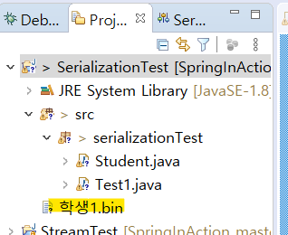
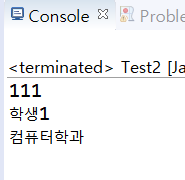
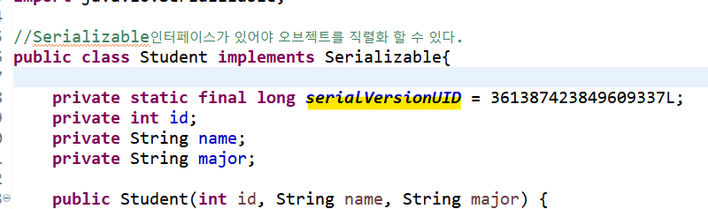

# 직렬화와 역직렬화

[직렬화 역직렬화 설명](https://www.youtube.com/watch?v=qrQZOPZmt0w)

[직렬화 역직렬화 예제](https://www.youtube.com/watch?v=variM5qJsQM)


1. **직렬화**(serialize)란

- 오브젝트를 연속된 String이나 byte 데이터로 바꾸는 것
- Serial : 연쇄, 연속해서 이어지는 어떤 것
- USB 인터페이스 = Universal Serial Bus 직선상으로 연속해서 들어오는 데이터를 받아들일 수 있는 인터페이스
- 데이터를 오브젝트로 바꾸는 것을 **역 직렬화**라고 한다.


2. 왜 쓰는가?

- 오브젝트는 메모리에 존재하고 추상적이지만, String이나 byte 데이터는 드라이브에 저장할 수 있고
  통신선으로 전송할 수 있다.
    - 역 직렬화로 데이터를 읽을 때 직렬화된 악성코드가 오브젝트화되면서 보안 문제가 생길 수 있다.
- bytes, xml, json, yaml 등이 직렬화 역 직렬화에 쓰인다. 


3. 예제코드

- Student.java
```java
//Serializable인터페이스가 있어야 오브젝트를 직렬화 할 수 있다.
public class Student implements Serializable{
	
	private int id;
	private String name;
	private String major;
	
	public Student(int id, String name, String major) {
		super();
		this.id = id;
		this.name = name;
		this.major = major;
	}

	public int getId() {
		return id;
	}

	public String getName() {
		return name;
	}

	public String getMajor() {
		return major;
	}	
}
```

- Test1(직렬화)
```java
public class Test1 {

	public static void main(String[] args) throws IOException {
		/*
		 * 직렬화 Object -> Binary 형태의 파일(0이나 1로 구성된 형태)
		 * .bin, ser이 붙은 파일은 Binary파일이다.
		 *  
		 * 역직렬화
		 * Binary 형태의 파일 -> Object로 변환
		 */		

		Student std = new Student(111, "학생1", "컴퓨터학과");
		
		System.out.println(
				std.getId()+"\n"+
				std.getName()+"\n"+
				std.getMajor()
				);
		
		/*
		 * 직렬화 
		 * 1. FileOutputStream(파일 선택 클래스) 
		 * 2. ObjectOutputStream(직접 저장)
		 * 
		 */
		
		/* FileOutputStream
		 * 임의의 파일경로 지정(SerializationTest 파일 위치로 지정하고 학생1.bin 파일을 
                *  생성할 것임)
		 * "C:\\Users\\OOO\\Documents\\"
				+ "SpringInAction\\SerializationTest\\학생1.bin"
		 * 
		 *  파일 이름(학생1.bin)만 쓰면 자바 프로그램이 있는 폴더 안에 자동으로 만들어준다.
		 * 
		 * 
		 * ObjectOutputStream
		 * 1. ObjectOutputStream 인스턴스에 FileOutputStream을 인자로 넣는다.
		 * 2. 그 다음 이 객체에 들어갈 Object파일을 넣는다.
		 * 3. ObjectOutputStream을 close한다.
		 * 
		 */
		FileOutputStream fsOut = new FileOutputStream("학생1.bin");
		ObjectOutputStream osOut = new ObjectOutputStream(fsOut);
		osOut.writeObject(std);
		osOut.close();//메모리 절약
	}

}
```



- Test2(역직렬화)
```java
public class Test2 {

	public static void main(String[] args) throws IOException, ClassNotFoundException {
		
		//주소지정 안하면 해당 애플의 파일 안의 bin파일을 찾는다.
		FileInputStream fsIn = new FileInputStream("학생1.bin");
		ObjectInputStream osIn = new ObjectInputStream(fsIn);
		
		
		//학생1.bin을 object로 읽는다.
		//Student 타입으로 캐스팅해야 clone에서 받아들일 수 있다.
		Student clone = (Student)osIn.readObject();
		osIn.close();//메모리절약
		
		System.out.println(
				clone.getId()+"\n"+
				clone.getName()+"\n"+
				clone.getMajor()
				);
		
	}

}

```



4. SerialVersionUID

- 위 예제대로 하면 Student.java에서 경고표시가 뜬다.
  직렬화를 사용하는 오브젝트에는 serialVersionUID라는 것을 사용하기 때문이다.
- UID를 변경하고 Test2(역직렬화)를 돌리면 bin파일이 버전이 맞지 않기 떄문에 읽어들이지 못한다.
- 변경된 UID를 가지고 Test1(직렬화)를 다시 한다면 새로운 버전의 bin파일이 만들어진다.



5. transient

- 오브젝트 필드에 transient를 지정하면 직렬화 또는 역직렬화 할 때
  지정된 필드를 저장하거나 불러들이지 않는다.


- transient 상태로 직렬화를 한다면 역직렬화 할 떄 입력값이 나타나지 않는다. 애초에 직렬화 할 때 관련 데이터가 저장되지 않는다.
- 클래스 내에 암호 값이나 키 값을 속성 내에서 사용하는데 전송되거나 저장하면 안되는 값을 transient로 지정하면 좋다.

